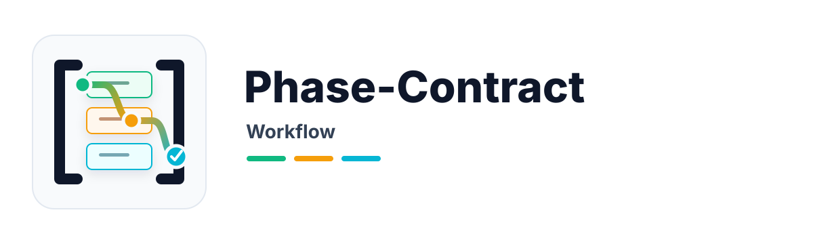

<div align="center">



# Phase-Contract Workflow

**About**: A practical workflow for long-running AI projects that need to survive context compression, fresh sessions, and Agent switches.

Instead of asking an Agent to remember everything, Phase-Contract breaks a large project into a clear sequence of small, reviewable steps. Progress lives in the repository, so the work can resume after a pause without depending on chat history.

> *"Move AI stability out of model memory and into the repository filesystem."*

[](https://www.npmjs.com/package/skills)
[](./references/agent-instructions-template.md)
[](./references/agent-instructions-template.md)
[](./references/agent-instructions-template.md)

**English** · [中文](./README.md)

</div>

***

**Quick links**: [Recommended scenarios](#recommended-scenarios) · [Install](#install--update) · [Quick start](#quick-start) · [How it works](#how-it-works) · [Documentation](#documentation-map)

## Why

Long AI sessions rarely fail because the model suddenly becomes incapable. They fail because the project thread gets blurry: goals mix together, the current task expands, and key decisions disappear after context compression. Phase-Contract gives that work a stable written structure, so the Agent can keep moving in the intended direction even after interruptions.

## Recommended scenarios

Use this Skill when the work is big enough that continuity matters. It is meant for projects where you want an Agent to keep going for hours or days without needing the same context to be re-explained every session.

### Good fit

It fits especially well when you are doing:

* **Large refactors and migrations**: framework upgrades, SDK replacements, and module rewrites are easier when the work is divided into manageable stages.
* **New product builds**: infrastructure, data, services, UI, testing, and release can move forward in a deliberate order instead of piling up in one conversation.
* **Long-form documentation work**: writing, review, formatting, and final delivery stay separate, which helps a long document keep its structure and tone.
* **Compliance, security, or data-governance remediation**: requirements stay visible, reviewable, and easier to trace across a long execution window.
* **Autonomous continuation**: the Agent can move from one current step to the next without you restating the whole project each time.

### What you get

The result is not a vague "I think I finished" report. You get a project record that is much easier to trust:

* a written history of what has actually been completed
* a recovery note for restarting after interruption or compression
* smaller milestones that are easier to review in Git
* a clearer handoff point for release, review, or archive decisions

### Minimal prompt

The simplest way to start is to tell the Agent:

```text
Plan and continuously execute this project with Phase-Contract: <your project goal>
```

### Daily loop

Once a plan exists, the daily rhythm is:

```bash
ruby scripts/planctl advance --strict
ruby scripts/planctl complete <phase-id> --summary "..." --next-focus "..." --continue
```

## Core idea

One line: **move AI continuity out of model memory and into the repository.** The Agent focuses on one current step at a time, while the repository keeps the shared record of progress and context.

### What keeps the work on track

* **Break a large goal into bounded steps.** Instead of asking the Agent to juggle the whole project at once, the workflow narrows attention to one current piece of work.
* **Keep shared state outside the chat.** Progress, current focus, and restart context live in the repository, so they survive compression and session changes.
* **Separate sequence from execution.** The script decides what the current step is; the Agent spends its effort doing the work inside that step.
* **Treat completion as a recorded event.** A step is only considered done after the repository says it is done, not because the Agent sounded confident.

### Corollary

This is not trying to make a prompt magically smarter. It is a practical way to make ordinary models behave more reliably on long projects.

## How it works

Three parts work together:

* **Shared instructions** keep expectations and guardrails aligned across Agents. They live in `.github/copilot-instructions.md`, `CLAUDE.md`, and `AGENTS.md`.
* **The workflow script** chooses the current step, records progress, and helps the project resume cleanly. It lives in `scripts/planctl`.
* **Project working files** describe the plan, the current work, and the recovery context. They live under `plan/*`.

### Runtime state

Two files matter most during day-to-day use:

* `plan/state.yaml` — the written record of progress
* `plan/handoff.md` — the note that helps the next session pick up quickly

## What users should know first

* **Git is not an optional extra**: the workflow relies on Git to verify scope, preserve milestones, and support rollback; without it, many "done" states stop being objectively trustworthy.
* **It protects the current step, not a fully frozen master plan**: there is an overall shape, but later steps are refined as the current step progresses, which is why future steps can remain placeholders at first.
* **Recovery follows a fixed protocol**: after compression or a fresh session, do not reload every phase document; recover through manifest → handoff → `advance --strict`, or simply use `resume --strict`.
* **`complete` is the normal write-back boundary**: it refreshes `state.yaml`, updates `handoff.md`, and records the Git milestone for the current phase; under normal use, do not hand-edit those files or make separate phase-level `git commit` / `git push` calls.
* **Finishing the last phase is not the same as closing the project**: when the script returns `ACTION: finalize`, run `finalize` once to produce the final dashboard and hand the next decisions back to the human.
* **If you change repository-level rules, keep the three Agent instruction files in sync**: `.github/copilot-instructions.md`, `CLAUDE.md`, and `AGENTS.md` are one shared constraint set, not three independent files.

## Install & update

Use the [`skills`](https://www.npmjs.com/package/skills) CLI to install this repo as an Agent Skill for Copilot, Claude Code, or Codex. For most users, one command is enough; the extra commands below cover explicit agent targeting and updates.

```bash
# Install into the current Agent's default skills directory (auto-detected)
npx skills add nanzhipro/phase-contract-workflow-skill

# Target a specific Agent explicitly
npx skills add github:nanzhipro/phase-contract-workflow-skill --agent claude
npx skills add github:nanzhipro/phase-contract-workflow-skill --agent copilot
npx skills add github:nanzhipro/phase-contract-workflow-skill --agent codex

# Update to latest main (add `-g` if it was installed globally)
npx skills update phase-contract-workflow -g

# Force reinstall (overwrites local edits - back up first)
npx skills add nanzhipro/phase-contract-workflow-skill --force

# Remove
npx skills remove phase-contract-workflow -g
```

Once installed, tell the Agent to plan a project with Phase-Contract in any session. If you want the full scaffolding flow and template behavior, see [SKILL.md](./SKILL.md).

## Golden loop

The workflow repeats the same simple rhythm. You start or resume, load the current project context, work on the current step, record progress, and continue until the project is ready to close out.

```text
advance --strict  →  load 3 docs  →  execute (within execution boundary)
                                           ↓
                    ← handoff (by script) ← complete <id> --continue
                                           ↓
                              (all phases done) → finalize
```

### Core commands

A single command kicks off, resumes, or wraps up:

```bash
ruby scripts/planctl advance --strict                  # new session / daily driver
ruby scripts/planctl resume --strict                   # cold start after compression
ruby scripts/planctl lint-contracts --phase <id>       # verify the current formal contract before implementation or before complete
ruby scripts/planctl complete <id> --summary "..." --next-focus "..." --continue
ruby scripts/planctl finalize                          # after every phase succeeds, write finalization ledger + git close-out, then print the dashboard
ruby scripts/planctl doctor                            # repo health check (SHA256-diff the three instruction files, etc.)
```

### What the script handles for you

The script does the mechanical parts that are easy for an Agent to get wrong in a long session:

* it checks whether the current step is ready before progress is recorded
* it keeps the project moving one current step at a time
* it asks for more detail when a future step is still only a placeholder
* this means the project is not fully specified upfront and then simply queued for execution; planning and reasoning continue as the current step reveals new constraints and information
* it only treats the project as finished when the planned work is fully accounted for

The detailed enforcement rules live in [references/phase-templates.md](./references/phase-templates.md) and [references/workflow-template.md](./references/workflow-template.md).

## Design principles

* **Put progress where people can inspect it** - in project files, not in a fading conversation.
* **Keep the current working context small** - a narrow focus is easier for both the Agent and the reviewer.
* **Separate deciding from doing** - the workflow chooses the current step so the Agent can concentrate on execution.
* **Make interruptions recoverable** - restarting should feel like resuming a project, not rebuilding memory.
* **Treat done as something recorded** - completion is a project fact, not a persuasive status update.

Full methodology and design rationale: [references/methodology.md](./references/methodology.md).

## When to use

### Use it for

Use it for 0-to-1 product builds, migrations, major upgrades, architecture replacements, long documentation projects, compliance work, and other efforts where continuity matters more than raw speed.

### Do not use it for

Avoid it for tiny fixes, open-ended exploration, or projects whose requirements are still changing so fast that no stable step sequence exists yet.

## Prerequisites

* A Git repository, so the workflow has a trustworthy project history to build on.
* Ruby 2.6 or newer, which runs the bundled `planctl` script.

## Quick start

When used as an Agent Skill, you can simply ask it to plan a project with Phase-Contract. The Skill then gathers the project framing, breaks the work into steps, and generates the working files described in [SKILL.md](./SKILL.md):

### Generated scaffold

```text
<project>/
├── .github/copilot-instructions.md
├── CLAUDE.md
├── AGENTS.md
├── plan/
│   ├── manifest.yaml
│   ├── common.md
│   ├── workflow.md
│   ├── state.yaml
│   ├── handoff.md
│   ├── phases/phase-0-*.md
│   └── execution/phase-0-*.md
└── scripts/planctl
```

### Manual installation

For manual installation in an existing project, copy `scripts/planctl.rb` and generate the companion files from the templates described in [SKILL.md](./SKILL.md).

### Placeholder promotion

You do not need to fully define every future step on day one. Only the current step needs full detail; future steps can stay lightweight until it is time to enter them.

More precisely, this workflow is not "fully plan every task first, then execute them in order." It is "establish the overall shape, then keep planning, reasoning, and refining the later steps while the current step is being executed." Placeholder contracts exist to support that pattern: future steps keep their direction and references early, but receive full detail only when they become current.

## Roadmap

The long-term direction is simple: make long AI projects easier to resume, safer to review, and calmer to operate.

1. **Safer recovery after partial failure** - so interrupted close-out actions can be resumed cleanly.
2. **Stronger checkpoints and rollback** - so each step is easier to inspect and reverse when necessary.
3. **Built-in replanning moments** - so long projects can adjust without losing their history.
4. **Better support for parallel work** - so large plans do not have to stay fully sequential.
5. **More targeted context retrieval** - so the next session gets only the context it actually needs.
6. **Budgets and health controls** - so repeated failure triggers calmer escalation instead of drift.

The guiding idea stays the same: **replace fragile AI self-discipline with dependable project structure.**

## Documentation map

* [SKILL.md](./SKILL.md) - installation and scaffolding procedure
* [references/glossary.md](./references/glossary.md) - terminology guide
* [references/methodology.md](./references/methodology.md) - full design rationale
* [references/templates.md](./references/templates.md) - core templates
* [references/phase-templates.md](./references/phase-templates.md) - step templates
* [references/workflow-template.md](./references/workflow-template.md) - workflow and close-out template
* [references/agent-instructions-template.md](./references/agent-instructions-template.md) - shared Agent instruction template
* [assets/README.md](./assets/README.md) - logo assets and design notes
* [CHANGELOG.md](./CHANGELOG.md) - version history

## License

This project shares the license of the parent Agent Skill library. `scripts/planctl.rb` has no external dependencies and can also be reused on its own.

<div align="center">

[English](./README.en.md) · [中文](./README.md)

</div>
