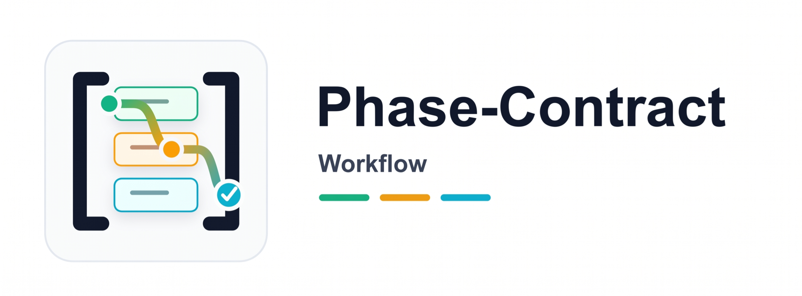

<div align="center">



# Phase-Contract Workflow

**简介**：一套面向长周期 AI 项目的实用工作流，让任务在压缩、换会话、换 Agent 之后依然能稳稳续跑。

Phase-Contract 不要求 Agent 把一切都记在上下文里，而是把大项目拆成一串清晰、可复查的小步骤。项目进度写在仓库里，所以即使中断很久，也能重新接上，而不是靠聊天记录回忆。

> *"把 AI 的稳定性从模型记忆迁移到仓库文件系统。"*

[](https://www.npmjs.com/package/skills)
[](./references/agent-instructions-template.md)
[](./references/agent-instructions-template.md)
[](./references/agent-instructions-template.md)

[English](./README.en.md) · **中文**

</div>

***

**快速导航**：[推荐场景](#推荐场景) · [安装](#安装与更新) · [快速开始](#快速开始) · [工作原理](#工作原理) · [文档索引](#文档索引)

## 为什么

长时间使用 AI 做项目，真正容易坏掉的往往不是能力，而是连续性。目标会混在一起，当前任务会越做越宽，关键决策会在压缩后丢失。Phase-Contract 的作用，就是给这段长期工作一套稳定的书面结构，让 Agent 在中断之后还能沿着原来的方向继续推进。

## 推荐场景

如果你已经不满足于让 AI“帮我改一个小功能”，而是希望它能在数小时甚至数天的项目里持续推进、不反复走失，这个 Skill 就适合你。

### 适合什么任务

你可以在这些场景里使用它：

* **大型重构 / 迁移**：比如框架升级、SDK 替换、模块重写。这类工作更适合被拆成一段一段推进，而不是塞进一轮对话里。
* **从 0 到 1 搭产品**：基础设施、数据、服务、界面、测试、发布，本来就是不同性质的工作，分开推进会更稳。
* **长文档 / 课程 / 报告工程**：写作、审校、格式化、交付各自独立，长期项目更容易保持结构和风格。
* **合规、安全、数据治理整改**：要求多、链路长、复查频繁，把过程写清楚会比“记住它”更可靠。
* **你想让 AI 能持续往前走**：它可以沿着当前步骤继续推进，而不是每次都从头解释一遍整个项目。

### 你最终会得到什么

用完之后，你得到的不是一句“我应该做完了”，而是一份更可信的项目记录：

* 哪些事情真的做完了，有明确记录。
* 中断之后怎么恢复，有现成线索。
* 每一步改动都更小、更容易在 Git 里复查。
* 到了该审阅、发版或归档的时候，交接点会更清楚。

### 最小触发方式

最简单的用法是在 Agent 里直接说：

```text
用 Phase-Contract 规划并连续推进这个项目：<你的项目目标>
```

### 日常推进命令

如果项目已经生成了 plan，日常推进通常就是：

```bash
ruby scripts/planctl advance --strict
ruby scripts/planctl complete <phase-id> --summary "..." --next-focus "..." --continue
```

## 核心思路

一句话：**把 AI 的连续性从模型记忆迁移到仓库本身。** Agent 只需要专注当前步骤，而项目的共同状态由仓库文件承载。

### 它为什么能更稳

* **先把大目标拆小。** 与其让 Agent 同时记住整个项目，不如让它一次专注当前这一段工作。
* **把共同状态写在仓库里。** 当前进度、当前关注点、恢复线索都在文件里，所以能跨压缩、跨会话延续。
* **让顺序和执行分开。** 脚本负责判断现在该做哪一步，Agent 负责把这一步做好。
* **把“完成”变成项目事实。** 一步工作只有在仓库里被记录下来，才算真的完成，而不是因为 Agent 说得很像完成。

### 推论

它不是试图把 Prompt 变魔法，也不是另起一套庞大的框架，而是一种更务实的办法：让普通模型在长项目里表现得更可靠一些。

## 工作原理

它主要由三部分配合起来：

* **共享指令**负责让不同 Agent 对项目边界和工作方式保持一致理解，位置在 `.github/copilot-instructions.md`、`CLAUDE.md`、`AGENTS.md`。
* **工作流脚本**负责判断当前步骤、记录进度、帮助下一次顺利接上，位置在 `scripts/planctl`。
* **项目工作文件**负责保存计划、当前工作与恢复线索，位置在 `plan/*`。

### 运行时状态

日常使用里，最关键的就是两份文件：

* `plan/state.yaml` — 项目进度记录
* `plan/handoff.md` — 下一次快速接上的恢复说明

## 使用前最值得知道的几件事

* **Git 不是可有可无的前提**：这套工作流依赖 Git 来核对改动范围、保留里程碑和支持回退；没有 Git，很多“完成”都无法被客观验证。
* **它保护的是“当前步骤”，不是一份一次写死的总计划**：先有一个总体骨架，但真正的细化会随着当前步骤的推进不断补全，所以未来步骤可以先保持占位。
* **恢复方式是固定的**：压缩或换会话后，不应该把全部 phase 文档重新装回上下文，而是按 manifest → handoff → `advance --strict` 的顺序恢复，或者直接用 `resume --strict`。
* **`complete` 是正常写回的唯一入口**：它负责刷新 `state.yaml`、`handoff.md`，并留下当前 phase 的 Git 里程碑；正常使用时不要手改这两个文件，也不要在 phase 中途自己 `git commit` / `git push`。
* **跑完最后一个 phase 也不等于项目结束**：当脚本提示 `ACTION: finalize` 时，还需要跑一次 `finalize`，把最终仪表盘和后续决策点交还给人。
* **如果你要改仓库级规则，三份 Agent 指令必须同步**：`.github/copilot-instructions.md`、`CLAUDE.md`、`AGENTS.md` 不是任选其一，而是需要保持一致的同一套约束。

## 安装与更新

推荐用 [`skills`](https://www.npmjs.com/package/skills) CLI 安装到 Copilot、Claude Code 或 Codex。多数情况下，一条命令就够了；后面的命令主要是给指定 Agent 或升级时使用。

```bash
# 安装（自动识别当前 Agent 的默认 skills 目录）
npx skills add nanzhipro/phase-contract-workflow-skill

# 显式指定目标 Agent
npx skills add github:nanzhipro/phase-contract-workflow-skill --agent claude
npx skills add github:nanzhipro/phase-contract-workflow-skill --agent copilot
npx skills add github:nanzhipro/phase-contract-workflow-skill --agent codex

# 升级到最新 main（全局安装要加 `-g`）
npx skills update phase-contract-workflow -g

# 重装（覆盖本地修改，请先备份）
npx skills add nanzhipro/phase-contract-workflow-skill --force

# 卸载
npx skills remove phase-contract-workflow -g
```

安装后，在 Agent 会话里直接让它用 Phase-Contract 规划你的项目即可。完整脚手架流程和模板说明见 [SKILL.md](./SKILL.md)。

## 黄金循环

整个工作流会重复一个很简单的节奏：开始或恢复，加载当前项目上下文，完成当前步骤，记录进度，然后继续往下走。

```text
advance --strict  →  读 3 份上下文  →  实施（守 execution 边界）
                                             ↓
                       ← handoff (脚本自动)  ←  complete <id> --continue
                                             ↓
                                  （全部完成）→ finalize
```

### 常用命令

一条命令即可启动、恢复或收尾：

```bash
ruby scripts/planctl advance --strict                  # 新会话 / 日常推进
ruby scripts/planctl resume --strict                   # 压缩后冷启动
ruby scripts/planctl lint-contracts --phase <id>       # 实施前或 complete 前检查当前正式合同
ruby scripts/planctl complete <id> --summary "..." --next-focus "..." --continue
ruby scripts/planctl reset                             # 整条 workflow 回到起点；会回退 planctl 里程碑历史，共享分支需手动 force push
ruby scripts/planctl finalize                          # 全部 phase 成功后写最终 ledger + git 收尾，然后输出全计划仪表盘
ruby scripts/planctl doctor                            # 仓库体检（三份指令 SHA256 比对等）
```

如果这条 plan 需要整体作废、重来，直接运行 `ruby scripts/planctl reset`。它会把 `plan/state.yaml`、`plan/handoff.md` 和 planctl 自动生成的 phase / finalize 里程碑一起退回 workflow 原点；若当前还没有任何 planctl 里程碑 commit，则回到当前 `HEAD` 的基线并清掉未提交 ledger。

### 脚本会替你兜住什么

脚本负责处理那些长会话里最容易出错、但又不值得反复靠人盯着的机械部分：

* 在记录进度前先检查当前步骤是否具备完成条件。
* 让项目始终围绕当前这一步推进，而不是同时摊开很多步骤。
* 如果未来步骤还只有一个占位说明，会提醒你先把它补成可执行的工作说明。
* 这意味着项目不是先把所有任务细节一次规划完再排队执行，而是在推进当前步骤时，持续补全后续步骤的理解、推理与规划。
* 只有当计划中的工作都被完整记账后，才会把项目视为真正收尾。

更细的规则可以看 [references/phase-templates.md](./references/phase-templates.md) 和 [references/workflow-template.md](./references/workflow-template.md)。

## 设计原则

* **把进度放在大家都能检查的地方**：写进项目文件，而不是藏在聊天里。
* **让当前工作保持足够小**：范围越收敛，Agent 和人类都越容易看清楚。
* **把“决定做什么”和“把它做好”分开**：这样执行时更稳定。
* **把中断恢复当成正常流程**：重新开始时应该像续上项目，而不是重新回忆。
* **把完成视为被记录的事实**：不是一段听起来很像完成的汇报。

完整的方法论和设计说明，见 [references/methodology.md](./references/methodology.md)。

## 适用边界

### 适用

适合大型从 0 到 1 产品、迁移项目、大版本升级、架构替换、长文档工程、合规整改，以及其他“连续性比一时速度更重要”的任务。

### 不适用

不适合一次性小修复、开放式探索，或需求还在剧烈变化、暂时无法稳定拆步的阶段。

## 前置条件

* 一个 Git 仓库，让工作流有可靠的项目历史可依附。
* Ruby 2.6 或更高版本，用来运行内置的 `planctl` 脚本。

## 快速开始

当作 Agent Skill 使用时，只要让它用 Phase-Contract 规划你的项目即可。Skill 会收集项目背景，把工作拆成步骤，并按 [SKILL.md](./SKILL.md) 生成所需文件：

### 生成出来的脚手架

```text
<project>/
├── .github/copilot-instructions.md
├── CLAUDE.md
├── AGENTS.md
├── plan/
│   ├── manifest.yaml
│   ├── common.md
│   ├── workflow.md
│   ├── state.yaml
│   ├── handoff.md
│   ├── phases/phase-0-*.md
│   └── execution/phase-0-*.md
└── scripts/planctl
```

### 手工接入

如果要手工接入现有项目，把 `scripts/planctl.rb` 复制过去，再根据 [SKILL.md](./SKILL.md) 里的模板补齐配套文件即可。

### 占位合同升级

刚开始时，不需要把所有未来步骤一次写满。先把当前步骤写清楚，后面的步骤保留轻量占位，等真正轮到它们时再补细即可。

更准确地说，这套工作流不是“先把全部任务完整规划好，再按顺序执行”，而是“先搭出总体骨架，再一边执行当前步骤，一边根据新发现继续规划、推理和细化后续步骤”。占位合同的意义就在这里：未来步骤先保留方向和接口，等真正进入时再升级成正式合同。

## 路线图

这个项目的长期方向很简单：让长时间 AI 项目更容易恢复、更容易复查，也更容易稳住节奏。

1. **更安全的中断恢复**：让收尾做到一半时，也能更平滑地继续。
2. **更强的检查点与回滚**：让每一步都更容易检查，也更容易撤回。
3. **内建重规划时机**：让长项目调整方向时不会丢掉历史。
4. **更好的并行支持**：让大型计划不必永远完全串行。
5. **更精准的上下文取回**：让下一次会话只拿到真正需要的部分。
6. **预算与健康控制**：让连续失败时更容易及时收敛，而不是继续漂移。

贯穿始终的思路没有变：**不要把稳定性寄托在 AI 自律上，而要把它做进项目结构里。**

## 文档索引

* [SKILL.md](./SKILL.md) — 安装与脚手架生成流程
* [references/glossary.md](./references/glossary.md) — 术语说明
* [references/methodology.md](./references/methodology.md) — 完整设计说明
* [references/templates.md](./references/templates.md) — 核心模板
* [references/phase-templates.md](./references/phase-templates.md) — 步骤模板
* [references/workflow-template.md](./references/workflow-template.md) — 工作流与收尾模板
* [references/agent-instructions-template.md](./references/agent-instructions-template.md) — 共用 Agent 指令模板
* [assets/README.md](./assets/README.md) — Logo 资产与设计说明
* [CHANGELOG.md](./CHANGELOG.md) — 版本记录

## 许可证

本项目沿用上层 Agent Skill 库的许可证；`scripts/planctl.rb` 没有外部依赖，也可以单独复用。
